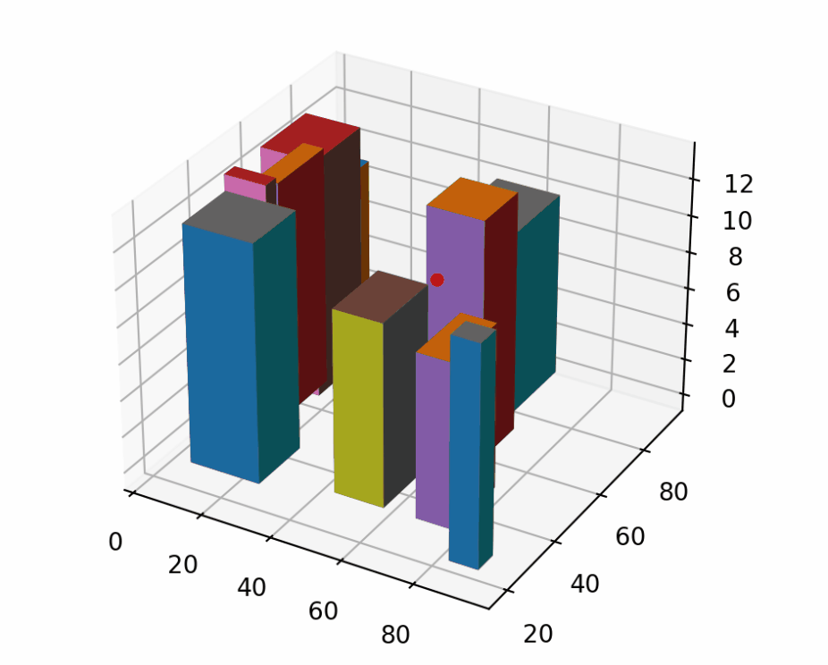
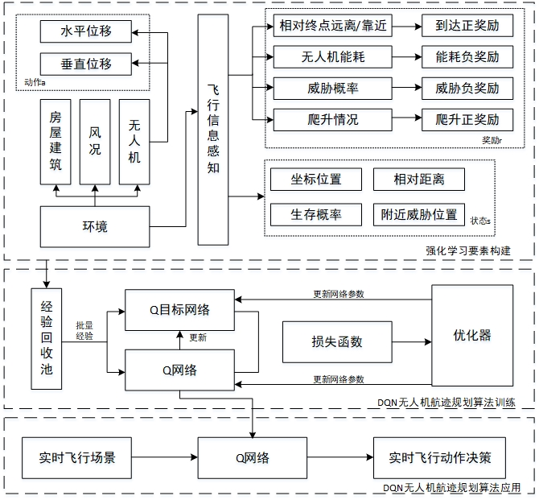

# 基于DQN算法的无人机三维城市空间航线规划

本文基于强化学习算法DQN实现离散3维城市空间环境下的智能航线规划,能根据无人机感知进行避障,并根据风速情况选择能耗较低的路线.

 

## 依赖

python pytorch

```bash
conda install pytorch torchvision torchaudio pytorch-cuda=12.1 -c pytorch -c nvidia
```

其他依赖

```bash
pip install -r requirements.txt
```

## 训练 & 运行

训练默认使用的是一个比较弱的预训练模型开始

```bash
python train.py
```

训练结束后自动生成 `checkpoints/Qlocal.pth` 和 `checkpoints/Qtarget.pth` 模型参数

观察结果

```bash
python watch_uav.py
```

## 预训练模型下载

|    model    |                                          download url                                           |
| :---------: | :---------------------------------------------------------------------------------------------: |
| Qlocal.pth  | [download](https://github.com/luzhixing12345/DQN-uav/releases/download/v0.0.1/Qlocal_1000.pth)  |
| Qtarget.pth | [download](https://github.com/luzhixing12345/DQN-uav/releases/download/v0.0.1/Qtarget_1000.pth) |

下载后保存在 `checkpoints/Qlocal_1000.pth` 和 `checkpoints/Qtarget_1000.pth`

```bash
python watch_uav.py
```
 
> 对训练结果 result.txt 处理数据并画图
>
> ```python
> python draw.py
> ```

实验报告见 [report.md](./report.md)

## 模型简介
在x100 y100 z22的三维空间中,采用课程学习方式对无人机智能体进行训练,利用设置好的不同难度的课程对智能体进行梯度训练,能让智能体更快地获取决策经验.由于训练初期缺乏决策经验,需要随机选择行为对环境进行试探,本文设置随机试探周期为1000,周期内采用ε-贪心策略选择智能体行为,周期内贪心概率从1逐渐递减到0.01.1000周期后贪心概率保持在0.01.在一个周期的训练场景中随机生成15个无人机对象,当所有无人机进入终止状态(电量耗尽、坠毁、到达目标点、超过最大步长)后进入下一个周期的训练,当80%以上的无人机能够到达目标点时进入下一难度等级的训练.
经过13万周期、19小时的迭代训练,最终无人机智能体能够在难度10的环境中以较高的任务完成率安全到达目标点.


## 项目说明 

DQN.py:(main函数 入口1)设置模型训练参数与城市环境参数,对DQN模型进行训练,输出Qlocal.pth与Qtarget.pth文件

watch_uav.py:(main函数 入口2)对训练好的决策模型进行测试,载入Qlocal.pth与Qtarget.pth文件,对无人机航迹规划过程进行可视化

env.py:设置env类,对城市环境进行描述,实现该环境中的所有UAV与传感器运行的仿真模拟

model.py:神经网络模型的定义

replay_buffer.py:经验池的定义

UAV.py:定义UAV类,对无人机的自身参数与行为进行描述

## 系统框架

## 训练参数设置 
env.py:
~~~ 
  env.reset()  #对仿真环境中的房屋建筑集合、无人机集合、传感器集合进行随机生成,对训练环境进行初始化 
  
  #Set the simulation environment parameters
  env. __init__() #对仿真环境参数进行设置
~~~
DQN.py
~~~ 
  BATCH_SIZE = 128    #批量大小
  TAU = 0.005 
  gamma = 0.99   #折扣率
  LEARNING_RATE = 0.0004   #学习率
  TARGET_UPDATE = 10   #Q网络更新周期 
  num_episodes = 40000  #训练周期长度 
  print_every = 1  
  hidden_dim = 16 ## 64 ## 16 #隐藏层维数 
  min_eps = 0.01    #贪心概率
  max_eps_episode = 10   #最大贪心次数
  space_dim = 42 # n_spaces   状态空间维度
  action_dim = 27 # n_actions   动作空间维度
  threshold = 200    
~~~
UAV.py:
~~~ 
  UAV. __init__()  #对UAV的参数进行设置
~~~
## 无人机状态空间
UAV.py:
~~~ 
def state(self):
        dx=self.target[0]-self.x
        dy=self.target[1]-self.y
        dz=self.target[2]-self.z
        state_grid=    [self.x,self.y,self.z,dx,dy,dz,self.target[0],self.target[1],self.target[2],self.d_origin,self.step,self.distance,self.dir,self.p_crash,self.now_bt,self.cost]
        #更新临近栅格状态  Update adjacent grid state
        self.ob_space=[]
        for i in range(-1,2):
            for j in range(-1,2):
                for k in range(-1,2):
                    if i==0 and j==0 and k==0:
                        continue
                    if self.x+i<0 or self.x+i>=self.ev.len or self.y+j<0 or self.y+j>=self.ev.width or self.z+k<0 or self.z+k>=self.ev.h:
                        self.ob_space.append(1) 
                        state_grid.append(1)
                    else:
                        self.ob_space.append(self.ev.map[self.x+i,self.y+j,self.z+k])  #添加无人机临近各个栅格状态
                        state_grid.append(self.ev.map[self.x+i,self.y+j,self.z+k])
        return state_grid  #无人机状态向量
~~~

## 奖励函数设置
UAV.py:

无人机未到达终止状态(未到达终点、未坠毁、为超最大步长)
~~~
        #计算总奖励 
        r=r_climb+r_target+r_e-crash*self.p_crash   
~~~
无人机到达终止状态
~~~
        #终止状态判断
        if self.x<=0 or self.x>=self.ev.len-1 or self.y<=0 or self.y>=self.ev.width-1 or self.z<=0 or self.z>=self.ev.h-1 or self.ev.map[self.x,self.y,self.z]==1 or random.random()<self.p_crash:
            #发生碰撞,产生巨大惩罚
            return r-200,True,2
        if self.distance<=5:
            #到达目标点,给予大量奖励
            #self.ev.map[self.x,self.y,self.z]=0
            return r+200,True,1 
        if self.step>=self.d_origin+2*self.ev.h:
            #步数超过最差步长,给予惩罚
            return r-20,True,5
        if self.cost>self.bt:
            #电量耗尽,给予大量惩罚
            return r-20,True,3
~~~
