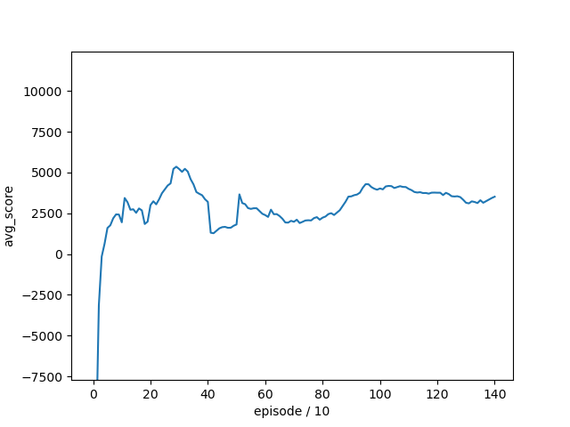
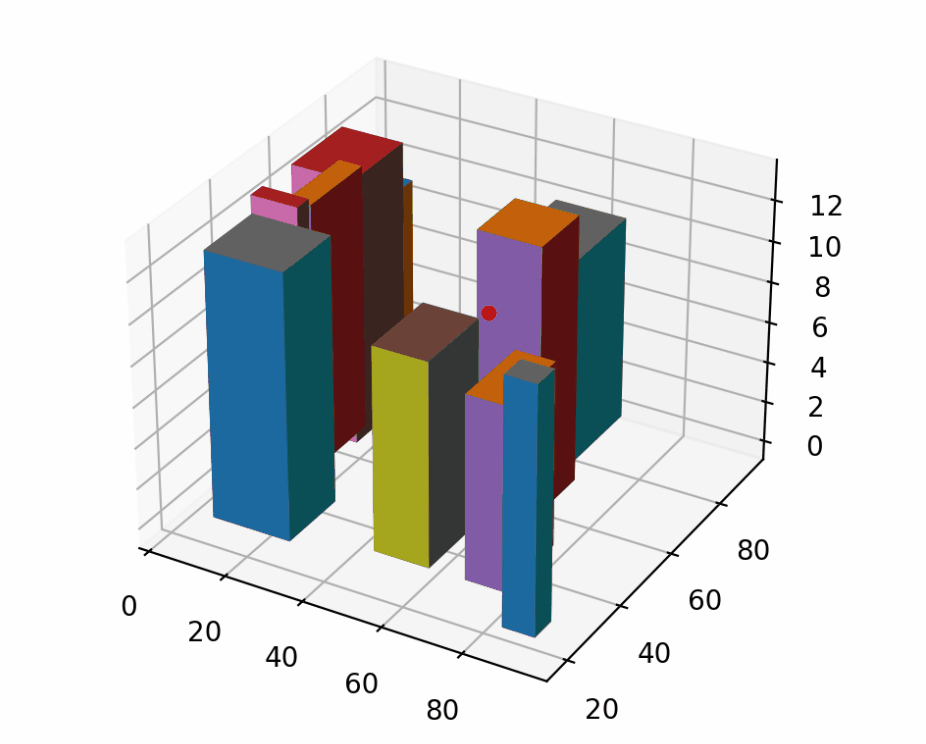
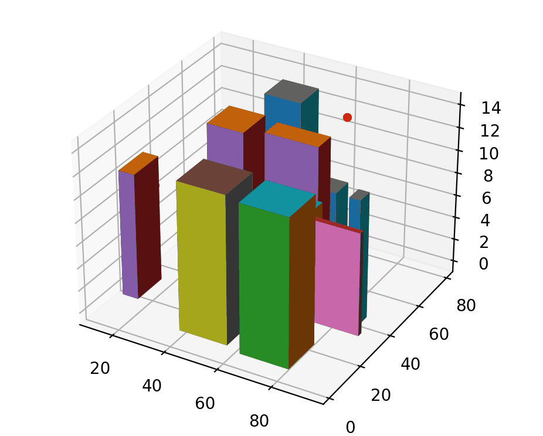

# 无人机智能规划的DQN方法实现报告

## 摘要

本报告旨在探讨无人机在复杂环境中的智能规划问题,并提出一种基于深度Q网络(DQN)的解决方案.通过构建一个虚拟的无人机飞行场景,我们设计了一个DQN算法来优化无人机的路径规划,以实现在保证安全的前提下,从起点到终点的最有效飞行.报告详细介绍了问题背景、假设条件、DQN基本框架、解决思路、案例分析,并对未来的研究方向进行了展望.

## 背景

无人机技术的迅猛发展已经引起了全球范围内的广泛关注.无人机不仅在军事领域发挥着重要作用,而且在民用领域也展现出巨大的潜力和价值.例如,在物流领域,无人机被用于实现快速配送服务;在农业领域,无人机用于作物监测和精准施肥;在环境保护领域,无人机用于野生动植物的监测和灾害评估.此外,无人机在搜索救援、交通管理、城市规划等多个方面都显示出了独特的优势.

然而,无人机的广泛应用也带来了一系列挑战.首先,无人机需要在复杂多变的环境中进行自主导航和避障,这要求无人机具备高度的感知能力和智能决策能力.其次,无人机的能源效率是一个关键问题,因为电池技术的限制使得无人机的续航能力受到严重制约.此外,无人机的安全性问题也不容忽视,如何确保无人机在执行任务时不会对人类或财产造成威胁,是无人机技术发展必须面对的问题.

在这样的背景下,无人机的智能规划成为了研究的热点.智能规划不仅要求无人机能够高效地完成任务,还要考虑到飞行的安全性、能源的合理利用以及对环境的适应性.传统的规划方法往往依赖于预先设定的规则或者复杂的数学模型,这些方法在面对动态和不确定的环境时往往效果不佳.因此,研究一种能够自适应学习、动态调整规划策略的智能规划方法,对于提高无人机的自主性和任务执行效率具有重要意义.

深度强化学习作为一种结合了深度学习和强化学习的技术,为解决上述问题提供了新的思路.特别是深度Q网络(DQN)算法,通过端到端的学习方式,使得无人机能够在与环境的交互中自主学习最优的飞行策略.这种方法不仅能够适应环境的变化,还能够在不断学习中提高规划的效率和安全性,为无人机在各种应用场景中的智能化发展奠定了坚实的基础.

## 问题阐述

在无人机智能规划的背景下,我们面临的是一个高度复杂且动态变化的挑战.具体来说,无人机在执行任务时需要实时处理大量的环境信息,并在此基础上做出快速而准确的决策.

- **环境动态性**:无人机操作环境的动态性要求无人机能够实时响应环境变化,如突然出现的障碍物、变化的天气条件以及其他无人机的行动.这些因素都会对无人机的路径规划产生影响.
- **多目标优化**:无人机在执行任务时往往需要同时考虑多个目标,如最短路径、最小能耗、最快到达时间等.这些目标之间可能存在冲突,需要无人机在规划路径时进行权衡和优化.
- **安全性要求**:无人机在飞行过程中必须确保安全性,避免与障碍物、其他无人机或地面设施发生碰撞.此外,无人机还需要遵守相关的飞行规则和法规,如保持在特定的飞行高度和空域内.
- **能源管理**:由于无人机的电池容量有限,如何在保证任务完成的前提下最大化飞行时间,是无人机智能规划中的一个重要问题.无人机需要根据当前的能源状况和任务需求,合理规划飞行路径和速度.
- **实时决策**:无人机在执行任务时需要实时做出决策.这意味着无人机的智能规划系统必须具备快速计算和响应的能力,以适应环境的快速变化.
- **感知与认知能力**:无人机需要具备一定的感知能力,通过搭载的传感器(如摄像头、激光雷达等)来感知周围环境.同时,无人机还需要具备一定的认知能力,能够理解感知到的环境信息,并在此基础上做出合理的规划.
- **适应性与泛化能力**:无人机在不同的任务和环境中可能需要采用不同的规划策略.因此,智能规划系统需要具备良好的适应性和泛化能力,能够快速适应新环境,并在不同的任务中表现出良好的性能.

真实世界的实际情况十分复杂, 因此我们做一些**简化**, 我们假设无人机在一个二维地图上飞行,地图中存在多个障碍物.无人机的目标是从起点飞行到终点,仅考虑以下因素:

- **避免**碰撞障碍物.
- **最小化**飞行距离或飞行时间.

## 基本框架

深度Q网络(DQN)是一种结合了深度学习和强化学习的算法,它通过学习一个策略来选择在给定状态下的最佳动作.DQN的核心是一个名为Q网络的神经网络,该网络预测在特定状态下采取特定动作的期望回报.


模型构成如上所示, 采用全连接层连接, 42x16x16x16x27 的维度, 模型大小 36KB

## 解决思路

- **环境建模**:构建一个二维网格世界作为无人机的飞行环境,其中包含起点、终点和若干障碍物.
- **状态表示**:无人机的状态由其在网格中的位置、速度、方向和电池电量组成.
- **动作空间**:无人机可以执行的动作包括向上、下、左、右移动以及加速和减速.
- **奖励函数**:设计一个奖励函数来指导无人机学习,奖励与飞行距离、碰撞、电池消耗和到达目标的速度相关.
- **DQN训练**:通过与环境交互,无人机使用DQN算法学习最优策略.在每个时间步,无人机根据当前状态选择动作,并接收环境的反馈(新状态和奖励).

建筑物的参数信息

```python
class building:
    def __init__(self, x, y, l, w, h):
        self.x = x  # 建筑中心x坐标
        self.y = y  # 建筑中心y坐标
        self.l = l  # 建筑长半值
        self.w = w  # 建筑宽半值
        self.h = h  # 建筑高度
```

无人机的信息

```python
class UAV:
    def __init__(self, x, y, z, ev):
        # 初始化无人机坐标位置
        self.x = x
        self.y = y
        self.z = z
        # 初始化无人机目标坐标
        self.target = [ev.target[0].x, ev.target[0].y, ev.target[0].z]
        self.ev = ev  # 无人机所处环境
        # 初始化无人机运动情况
        self.bt = 5000  # 无人机电量
        self.dir = 0  # 无人机水平运动方向,八种情况(弧度)
        self.p_bt = 10  # 无人机基础能耗,能耗/步
        self.now_bt = 4  # 无人机当前状态能耗
        self.cost = 0  # 无人机已经消耗能量
        self.detect_r = 5  # 无人机探测范围 (格)
```

核心强化学习算法

```python
def learn(self, gamma, BATCH_SIZE):
    """Prepare minibatch and train them  准备训练

    Args:
    experiences (List[Transition]): batch of `Transition`
    gamma (float): Discount rate of Q_target  折扣率
    """

    if len(self.replay_memory.memory) < BATCH_SIZE:
        return

    transitions = self.replay_memory.sample(BATCH_SIZE)  # 获取批量经验数据

    batch = Transition(*zip(*transitions))

    states = torch.cat(batch.state)
    actions = torch.cat(batch.action)
    rewards = torch.cat(batch.reward)
    next_states = torch.cat(batch.next_state)
    dones = torch.cat(batch.done)

    # Compute Q(s_t, a) - the model computes Q(s_t), then we select the
    # columns of actions taken. These are the actions which would've been taken
    # for each batch state according to newtork q_local (current estimate)
    Q_expected = self.q_local(states).gather(1, actions)  # 获得Q估计值

    Q_targets_next = self.q_target(next_states).detach().max(1)[0]  # 计算Q目标值估计

    # Compute the expected Q values
    Q_targets = rewards + (gamma * Q_targets_next * (1 - dones))  # 更新Q目标值
    # 训练Q网络
    self.q_local.train(mode=True)
    self.optim.zero_grad()
    loss = self.mse_loss(Q_expected, Q_targets.unsqueeze(1))  # 计算误差
    # backpropagation of loss to NN
    loss.backward()
    self.optim.step()
```

奖励函数中首先根据Q值选取动作,然后根据选取的动作改变状态,获取收益,求总收益, 同时存储每一次的交互经验

对于成功的状态进行正奖励,加强经验并完成状态变更

如果通过率较大,则难度升级

## 实验分析

为了验证DQN算法的有效性,我们在一个包含多个障碍物的复杂环境中进行了模拟实验.实验结果显示,经过足够的训练后,无人机能够有效地学习到从起点到终点的最优路径,同时避免了障碍物并考虑了电池续航.

模型训练过程中的平均得分变化:



运行演示





## 结论与展望

本报告提出的基于DQN的无人机智能规划方法,能够有效地解决复杂环境下的路径规划问题.未来研究可以进一步探索多无人机协同规划、三维空间规划以及实际应用场景中的实时适应性问题.此外,结合其他先进的强化学习算法,如PPO或A3C,可能会进一步提高无人机的规划性能.

## 参考

- [DQN-uav](https://github.com/luzhixing12345/DQN-uav)
- [alexlenail](https://alexlenail.me/NN-SVG/index.html)